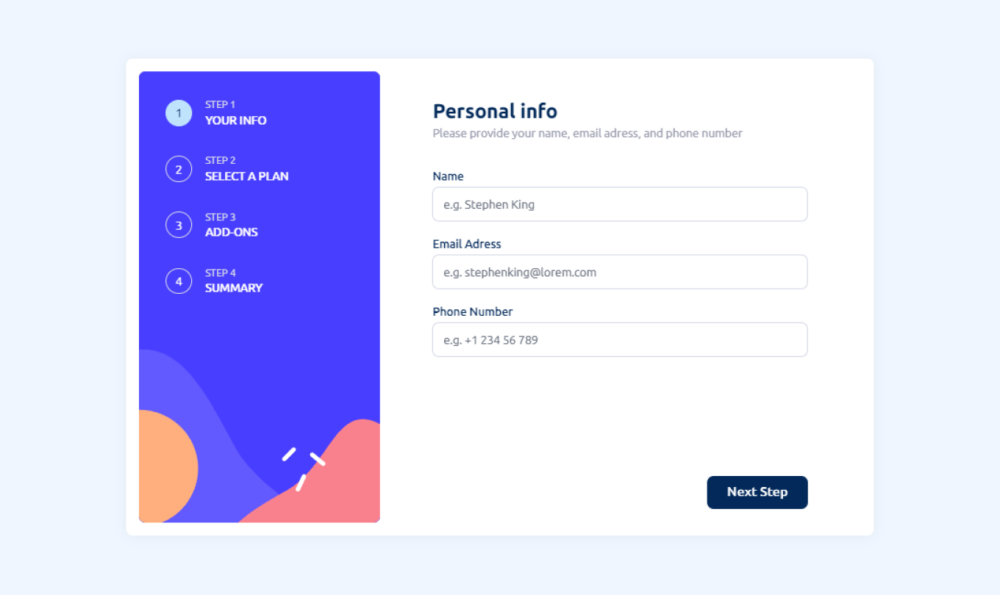
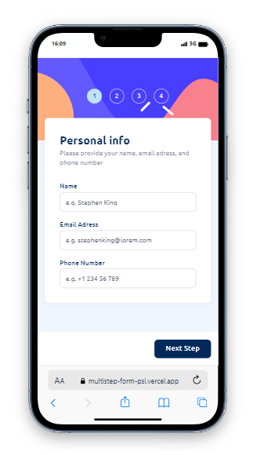
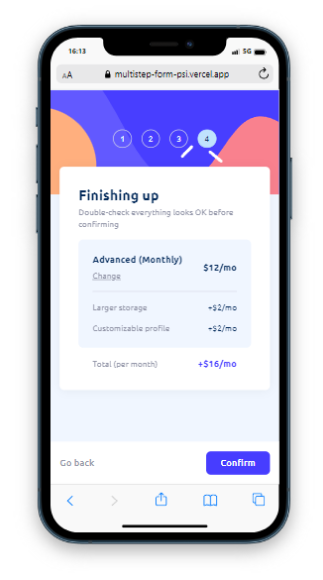

## Screenshot





# Multistep Form


This is a multistep form project created as a frontend challenge for [Frontend Mentor](https://www.frontendmentor.io/challenges). It allows users to go through a series of steps, providing information as they progress through each step. The form allow people buy a kind of gamer's plans. The project is built using Next.js, Tailwind CSS, TypeScript, and Zustand for state management.

## Demo

You can view a live demo of the project [here](https://multistep-form-psi.vercel.app/).

## Technologies Used

- [Next.js](https://nextjs.org/)
- [Tailwind CSS](https://tailwindcss.com/)
- [TypeScript](https://www.typescriptlang.org/)
- [Zustand](https://github.com/pmndrs/zustand)

## Features

- Responsive design: The form is optimized for various screen sizes and devices.
- Multistep process: Users can easily navigate through multiple steps to complete the form.
- State management: Zustand is used for efficient state management, ensuring a smooth user experience.

## Getting Started

1. Clone the repository:

   ```bash
   git clone https://github.com/your-username/multistep-form.git
   ```
